# <strong> Health Insurance Prediction

<h1>Insurance All Prediction</h1>

Insurance All is a company that provides health insurance to its customers and the product team is analyzing the possibility of offering policyholders a new product: auto insurance.

As with health insurance, customers of this new auto insurance plan need to pay an amount annually to Insurance All to obtain an amount insured by the company, intended for the costs of an eventual accident or damage to the vehicle.

Insurance All conducted a survey of about 380,000 customers about their interest in joining a new auto insurance product last year. All customers expressed interest or not in purchasing auto insurance and these responses were saved in a database along with other customer attributes.

The product team selected 127 thousand new customers who did not respond to the survey to participate in a campaign, in which they will receive the offer of the new auto insurance product. The offer will be made by the sales team through telephone calls.

However, the sales team has the capacity to make 20 thousand calls within the campaign period.

 

## The challenge

In that context, you were hired as a Data Science consultant to build a model that predicts whether or not the customer would be interested in auto insurance.

With its solution, the sales team hopes to be able to prioritize the people with the greatest interest in the new product and, thus, optimize the campaign by making only contacts with customers most likely to make the purchase.

As a result of your consultancy, you will need to deliver a report containing some analysis and answers to the following questions:

- Main Insights on the most relevant attributes of customers interested in purchasing auto insurance.
- What percentage of customers interested in purchasing auto insurance will the sales team be able to reach by making 20,000 calls?
- And if the sales team's capacity increases to 40,000 calls, what percentage of customers interested in purchasing auto insurance will the sales team be able to contact?
- How many calls does the sales team need to make to contact 80% of customers interested in purchasing auto insurance?

Source: https://smallbusiness.chron.com/insurance-companies-work-60269.html
___

 

The data is available in the link below:

https://www.kaggle.com/anmolkumar/health-insurance-cross-sell-prediction

For this project the data was hosted on AWS (RDS). The code to collect the data is called Health_Insurance_data_collection.ipynb

In this case the provided data is imbalanced, this is a feature of events that are not very common or rare, in this case due to the possibility that most customers will not accept the new insurance.

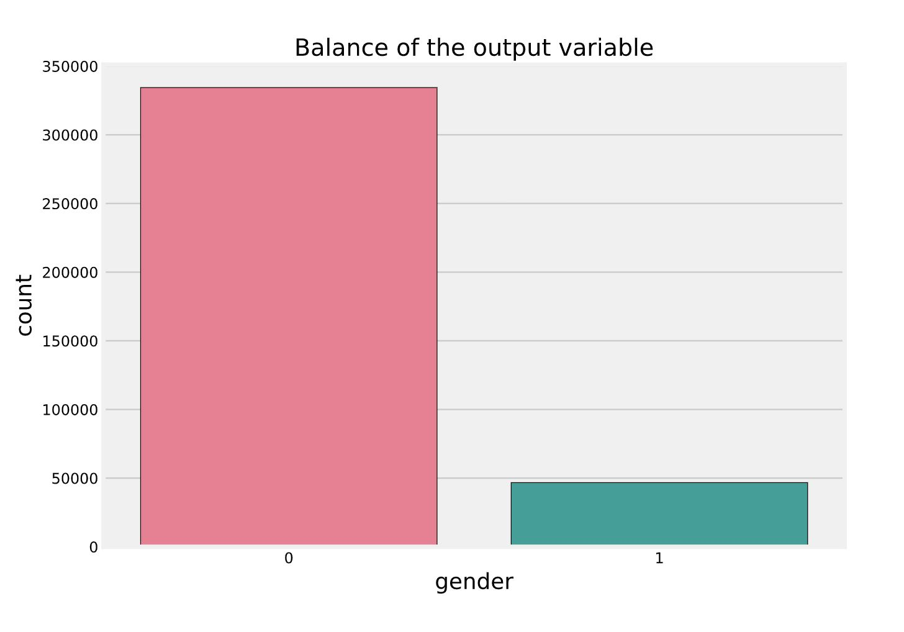

This is the dataset used in this project containing the informations of the current customers

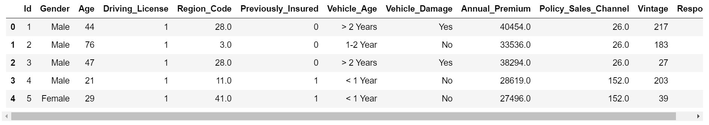

One of the most important steps in data science is the feature selection and the main features were selected using Feature Importance, Permutation Importance
and Boruta.
The results were analyzed and the explanation 

 
 

Feature Selection methods

 
- Feature Importance
 
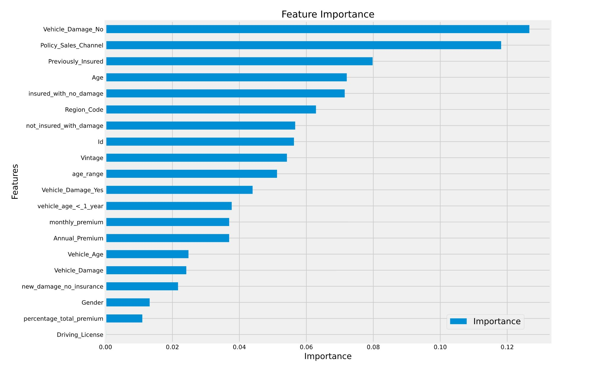
 
 
- Permutation Importance
 
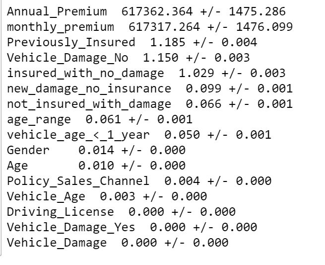
 
 
- Boruta
 
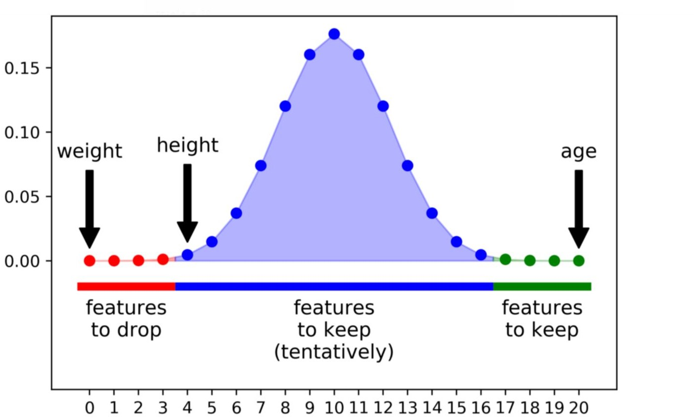
 
Features selected
id, Age, Region_Code, Previously_Insured, Policy_Sales_Channel, Vintage, age_range, Vehicle_Damage_No, Vehicle_Damage_Yes, insured_with_no_damage, not_insured_with_damage, vehicle_age_<_1_year

 
 

## Summary
___
**- Feature Importance using Random Forest (Top 5 features)**

percentage_total_premium, Policy_Sales_Channel, Previously_Insured, Vehicle_Damage_Yes and Age.
___

**- Permutation Importance (excluding features with high standard deviation)**

Top 5 features

Previously_Insured, percentage_total_premium, Vehicle_Damage_Yes, vehicle_age_<_1_year and insured_with_no_damage.

___
**- Boruta**

Features selected

id, Age, Region_Code, Previously_Insured, Policy_Sales_Channel, Vintage, age_range, Vehicle_Damage_No, Vehicle_Damage_Yes, insured_with_no_damage, not_insured_with_damage, vehicle_age_<_1_year
___
**- Mutual info (Top 5 features)**

Features selected

Policy_Sales_Channel, Region_Code, Vehicle_Damage_No, Previously_Insured and not_insured_with_damage
___
 

Feature selection conclusions

- age_range came from Age, features related to customer age were indicated in two analysis (Feature Importance and Boruta)
- percentage_total_premium was indicated in two analysis (Feature Importance and Permutation Importance)
- Features related to vehicle damage were indicated in all analysis(ANOVA, Feature Importance, Permutation Importance and Boruta)
- Policy_Sales_Channel was indicated in two analysis(Feature Importance and Boruta)
- Previous_Insured was indicated in three analysis(Feature Importance, Permutation Importance and Boruta)

___
 
 

**- Results of the models:**
 
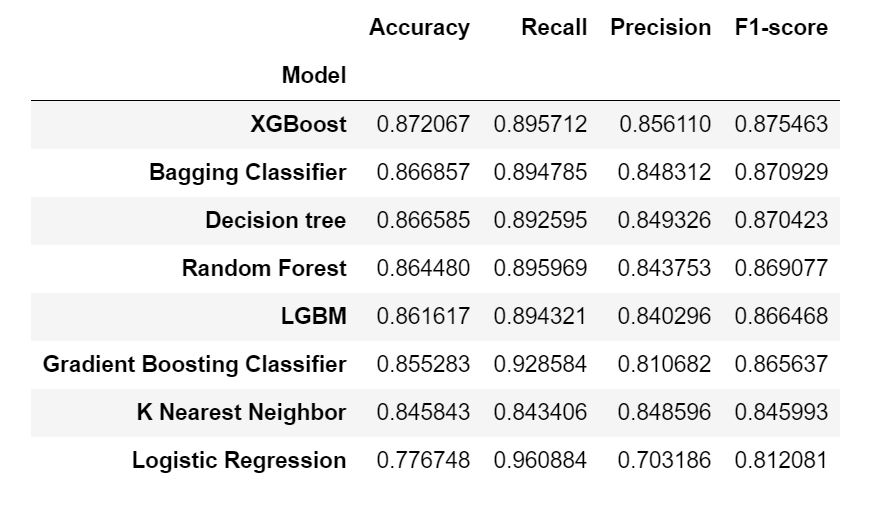
 
 
 
 

The best model was chosen using GridSearchCV and the parameters max_depth and n_estimators. XGBoost ended up as the best model in terms of recall and F1-score, the loss and error charts were plotted to show its performance:
 
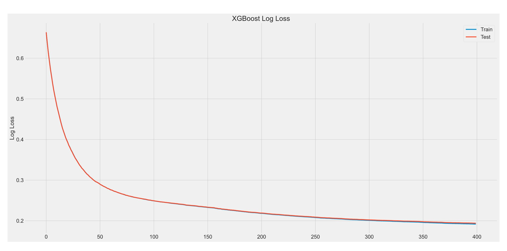
 
 
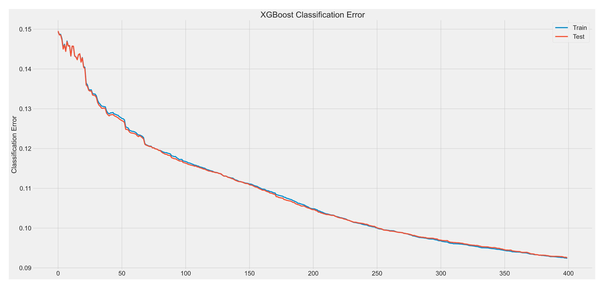
 
 

## Metrics:
___
 
The main metrics were chosen to evaluate the model performance
 
Comparison of the models
 
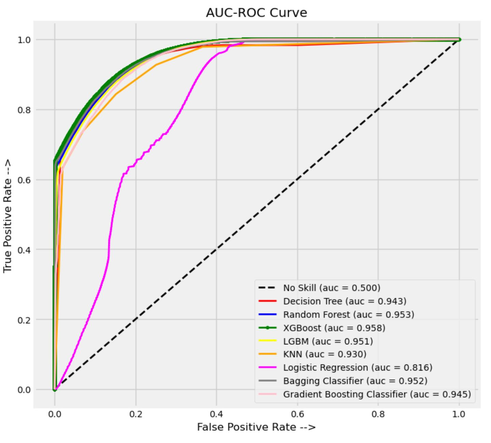
 
 
ROC curve
 
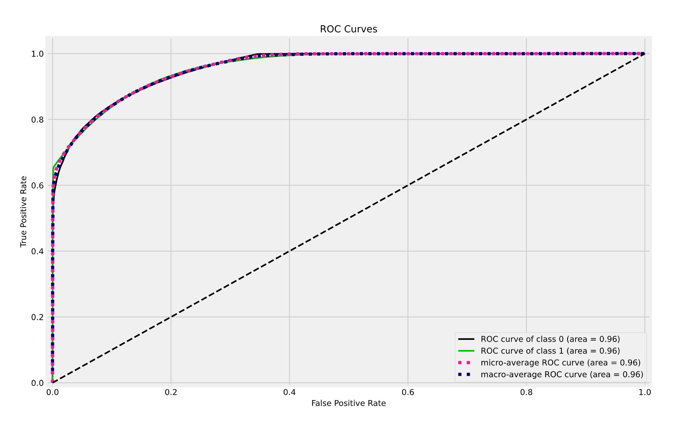
 
 
Cumulative gains curve
 
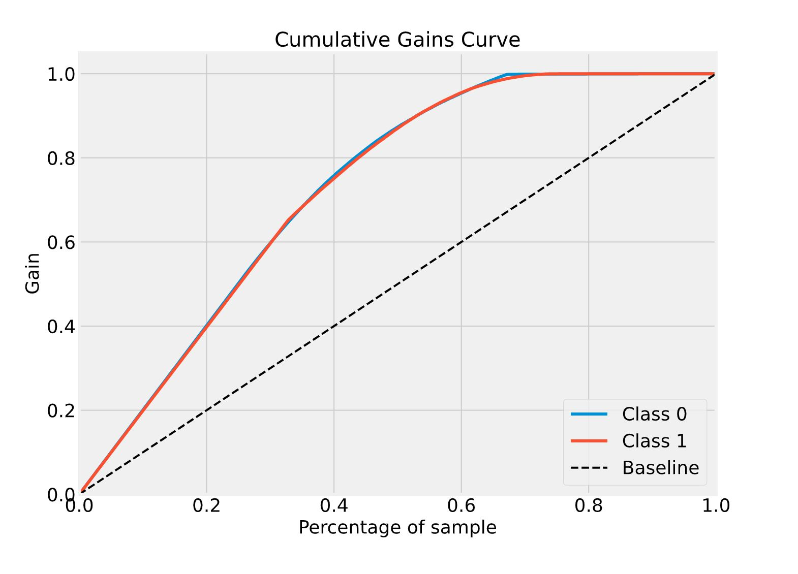
 
 
Lift curve
 
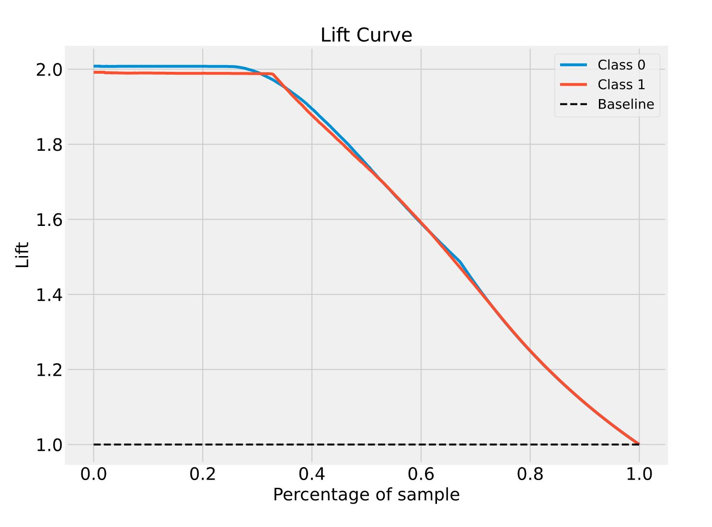
 
 

## Conclusions:
___
- In the first step, a model was trained that was built using 5 features taking into account a compilation of information from the feature selection methods.
This model presented better results when checking the calibration chart, which means, the model is better for predicting probabilities.

- In the second step, all the features selected by the Boruta method were used and better results were observed for the Recall and F1-Score metrics, which are the most important for this problem.

- The XGBoost algorithm showed the best results mainly considering the metrics Recall and F1-score, which means, it was the model chosen to make the predictions.

- The oversampling method played a crucial role in solving the problem, since the results with unbalanced data were very bad and were not even worth being presented.
